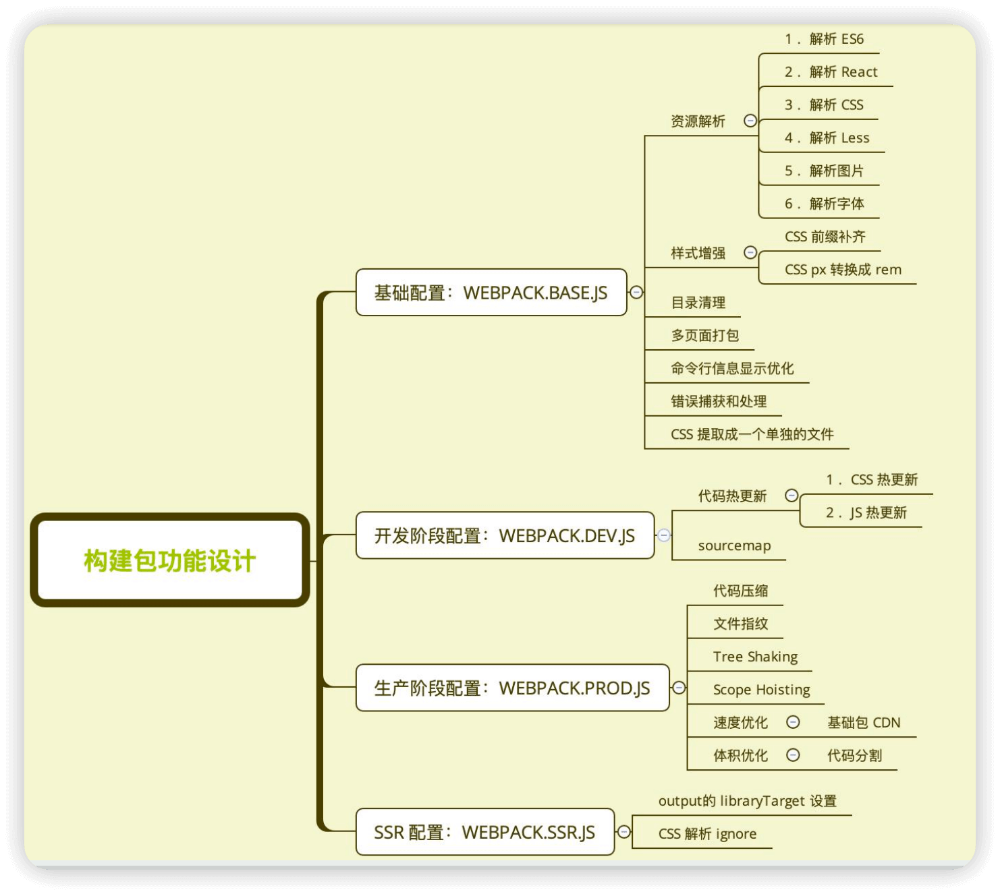

## 工程化部署

Q1.1 如何 把 webpack构建配置 抽离成 npm包

A: <br/>

1 抽离成 npm包 的好处

S1 通用性
  - 业务开发者无需关注构建配置
  - 统一团队构建脚本

S2 可维护性
  - 构建配置合理的拆分
  - README 文档、ChangeLog 文档等

S3 质量
  - 冒烟测试、单元测试、测试覆盖率
  - 持续集成


2 webpack构建配置管理 的可选方案

方案1: 通过多个配置文件管理不同环境的构建，webpack --config 参数进行控制

方案2: 将构建配置设计成一个库，比如：hjs-webpack、Neutrino、webpack-blocks

方案3: 抽成一个工具进行管理，比如：create-react-app, kyt, nwb

方案4: 将所有的配置放在一个文件，通过 --env 参数控制分支选择


3 以方案1为例，构建配置包的 总体设计是:

S1 通过多个配置文件管理不同环境的 webpack 配置
  - 基础配置：webpack.base.js
  - 开发环境：webpack.dev.js
  - 生产环境：webpack.prod.js
  - SSR环境：webpack.ssr.js 
  …… 

S2 抽离成一个 npm包 统一管理
  - 规范：Git commit日志、README、ESLint 规范、Semver 规范
  - 质量：冒烟测试、单元测试、测试覆盖率和 CI

S3 通过 webpack-merge 组合配置
  - 合并配置: module.exports = merge(baseConfig, devConfig)


S4.1 构建配置包的功能设计图示



S4.2 构建配置包的 目录结构
  - lib: 放置 源代码
  - test: 放置 测试代码
  - README.md: 项目说明
  - CHANGELOG.md: 变更日志
  - .eslintrc.js: ESLint 配置
  - package.json: 项目配置
  - index.js: 配置包的 入口文件

```md
+ |- /test

+ |- /lib
+ |-   webpack.dev.js
+ |-   webpack.prod.js
+ |-   webpack.ssr.js
+ |-   webpack.base.js

+ |- README.md
+ |- CHANGELOG.md
+ |- .eslinrc.js
+ |- package.json
+ |- index.js
```


-----------------------------------------------------------------------------
Q2.1 如何配置 npm构建包的 ESLint规范

A: <br/>

1 因为是基础构建包，所以所使用的 ESLint 规范不需要 第三方开发库，可以使用基础的 eslint-config-airbnb-base

2 在 .eslintrc.js 中配置 ESLint 规范

```js
// .eslintrc.js
module.exports = {
  // 指定解析器，@babel/eslint-parser
  parser: "@babel/eslint-parser",
  // 继承 airbnb 规则集
  extends: "airbnb-base",
  // 指定代码运行的环境
  env: {
    browser: true,
    node: true
  }
};
```

3 在 package.json 中添加 「自动检查 和 格式问题自动修复」 命令

```json
// package.json
{
  "scripts": {
    "lint": "eslint ./lib --fix"
  }
}
```

4 需要注意，构建包里的 很多依赖都是 dependencies，需要注意哪些是 开发依赖，哪些是 生产依赖
  - devDependencies: 开发时用到的依赖（如 ESLint、测试工具等）
  - dependencies: 构建过程中必需的依赖（如 webpack、loaders、plugins 等）


## 参考文档

[01-极客时间-抽离 配置npm包 部分](/)
