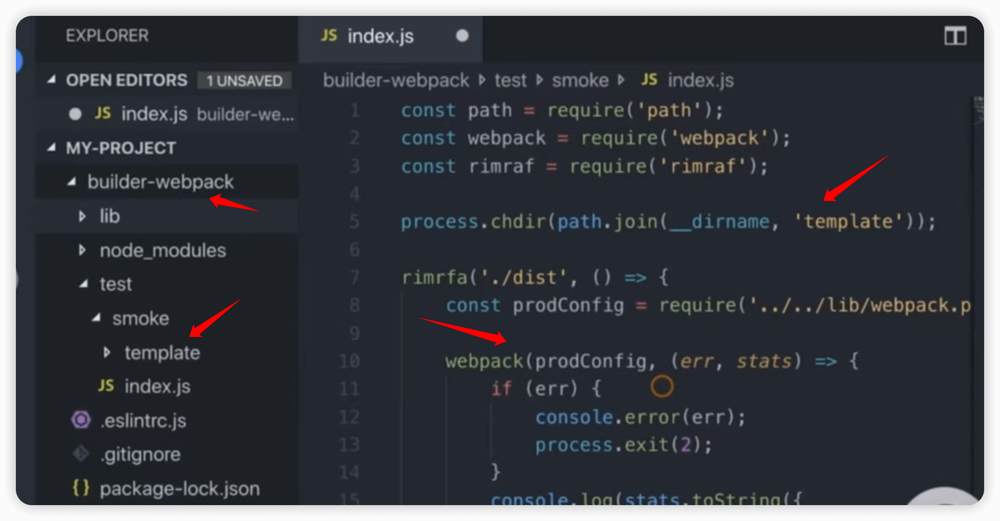
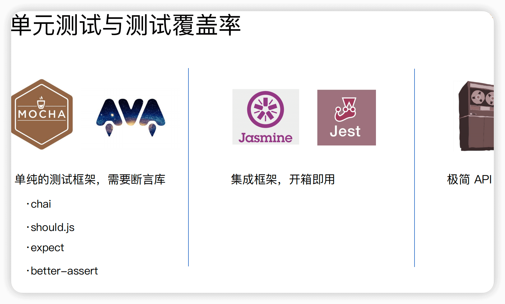

## 工程化部署

Q1.1 如何 对 webpack的npm构建包 进行冒烟测试

A: <br/>

1 冒烟测试: 主要是 通过自动化工具 测试 代码的核心基本功能

2 webpack的npm构建包 的 核心基本功能是:
  - 构建是否成功
  - 每次构建完成 build 目录是否有内容输出: 
    - 是否有 HTML 文件
    - 是否有 JS、CSS 等静态资源文件


3.1 测试 webpack 构建是否成功:

S1 创建测试功能目录，其结构是

builder-webpack
  |lib/: 构建包的源码
  | node_modules/: 构建包的依赖
  | ......
  | ......
  | test/: 测试目录
     | smoke/: 冒烟测试目录
        | template/:  源码功能的最小化功能目录
        | index.js: 冒烟测试 入口脚本: 测试 webpack 构建是否成功
        | html-test.js: 测试 dist 目录是否输出 HTML 文件
        | css-js-test.js: 测试 dist 目录是否输出 JS/CSS 文件

S2 通过 webpack实例，运行导入的配置文件，通过其回调函数，测试构建是否成功

```js
const webpack = require('webpack');
const config = require('./lib/config.js');

webpack(config, (err, stats) => {
  if (err) {
    console.error(err);
    process.exit(1);
  }
  console.log(stats.toString({ colors: true }));
});
```

具体配置，参考配置图片

  

3.2 测试 每次构建完成 build 目录是否有内容输出: 
  - 是否有 HTML 文件
  - 是否有 JS、CSS 等静态资源文件


S1 在测试目录主入口index.js里，引入mocha实例 及其 测试文件

```js
const Mocha = require('mocha');
const mocha = new Mocha({
  timeout: '10000ms'
});

webpack(prodConfig, (err, stats) => {
  // .......
  // 无报错情况下    
  mocha.addFile(path.join(__dirname, 'html-test.js'));
  mocha.addFile(path.join(__dirname, 'css-js-test.js'));
  mocha.run();
});
```

S2 在 html-test.js/css-js-test.js 里，通过 glob 方法，判断 dist 目录是否输出 HTML/JS/CSS 文件

```js
const glob = require('glob-all');
describe('Checking generated html files', () => {
  it('should generate html files', (done) => {
    const files = glob.sync([
      './dist/index.html',
      './dist/search.html'
    ]);
    if (files.length > 0) {
      done();
    } else {
      throw new Error('no html files generated');
    }
  });
});
```


-----------------------------------------------------------------------------
Q2.1 如何 对 webpack的npm构建包 进行单元测试

A: <br/>

1 单元测试库推荐，见



2 单元测试接入实现步骤

S1 安装 mocha + chai

``` bash
npm i mocha chai -D
```

S2 创建 test 目录
  - 创建 test/index.js 单元测试主入口文件，用于require 各个具体的 单元测试 实现文件
  - 创建 test/unit/xxx.test.js 单元测试文件

```js
// test/index.js
const path = require('path');
process.chdir(path.join(__dirname, 'smoke/template'));
describe('builder-webpack test case', () => {
  require('./unit/webpack-base-test');
});

// test/unit/webpack-base-test.js
const assert = require('assert');
describe('webpack.base.js test case', () => {
  const baseConfig = require('../../lib/webpack.base.js')
  it('entry', () => {
    assert.equal(baseConfig.entry.index, xxx);
    assert.equal(baseConfig.entry.search, xxx);
  });
});
```

S3.1 在 package.json 中的 scripts 字段增加 test 命令

```json
"scripts": {
  "test": "node_modules/mocha/bin/_mocha"
}
```

S3.2 如果想获取到 测试覆盖率，则需要在安装 istanbul 库后，配置 test 命令为

```json
"scripts": {
  "test": "istanbul cover node_modules/mocha/bin/_mocha"
}
```

S4 执行测试命令

```bash
npm run test
```


## 参考文档

[01-极客时间-npm构建包测试部分 部分](/)
