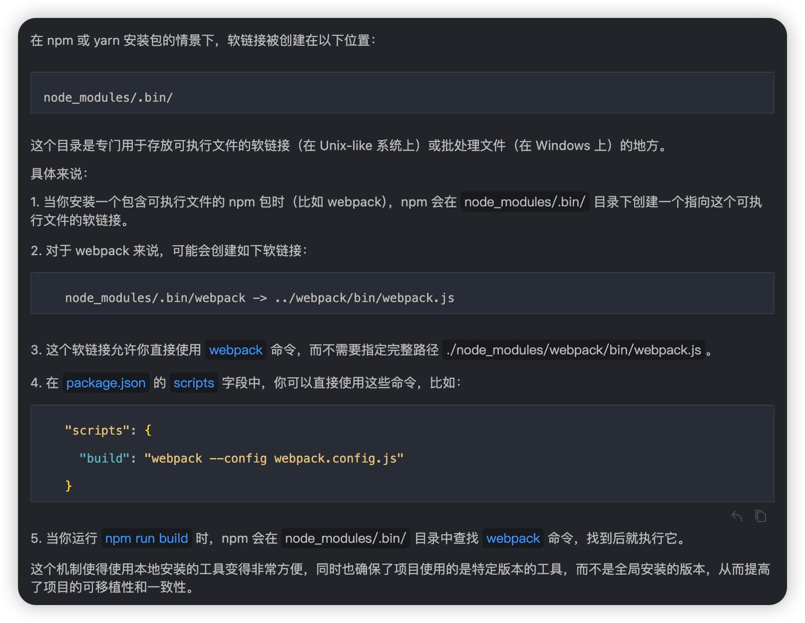
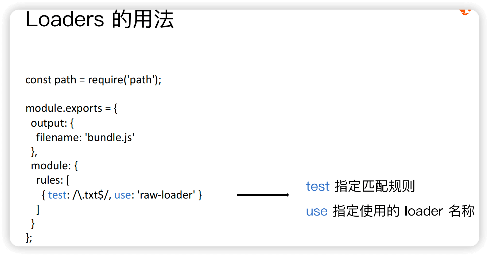

## 核心问题

Q1 说说你对webpack的理解，它解决了什么问题

A: <br/>

1 一句话总结： Webpack 是一个前端 「模块化打包工具」，它通过统一的模块化方案 和 构建流程，成为了「前端工程化」的基石


> 2 作用1: 统一支持 各个模块化规范

2.1 一开始的 前端开发方式代码见下，它主要有以下问题： 
  - 文件依赖关系不清晰 + 要手动管理 文件加载顺序
  - 全局变量污染，容易出现 命名冲突
  - 文件请求过多，导致请求时间变长

2.2 为了解决以上问题，出现了 「模块化」的规范概念
  - 模块化 通过「导入导出」 语法，明确了 文件之间的依赖关题
  - 通过 「以文件为单独的独立作用域」，解决了 全局变量污染的问题
  - 至于 文件请求过多，解决方法见下文

2.3 虽然出现了「模块化」规范，但是在具体实现上，出现了 多种模块化规范
  - CommonJS规范 是同步加载，浏览器不支持
  - AMD规范 是异步加载 + 写法复杂
  - ESM规范 是异步加载 + 写法简洁 + 旧版本浏览器不支持

2.4 而webpack的出现，统一支持了 各个模块化规范


```html
<!-- 无模块化规范时的 index.html -->
<!-- 缺点1: 如果b.js依赖a.js， 就需要手动保证 a.js在b.js之前加载 -->
<!-- 缺点2: a.js和b.js里的变量都是 全局变量，可能会存在 命名冲突 -->
<!-- 缺点3: 各种JS文件 请求过多，会导致请求时间变长 -->

<script src="a.js"></script>
<script src="b.js"></script>
<script src="c.js"></script>
```

```js
// 使用模块化规范后的 index.js
import a from './a.js'
import b from './b.js'
import { c } from './c.js'
```


> 3 作用2: 统一 多种资源类型的加载==> "一切皆模块"

3.1 前端开发中，涉及 HTML/ CSS/ JS/ 图片 /字体 等多种类型资源，每种资源的 加载方式各有不同，都需要用各自写法 单独处理

3.2 而 webpack 通过 loader机制 把各种资源 都转换为了模块，统一进行依赖管理和打包优化，既提升了开发体验，又提高了 加载性能

```html
<!-- 无 webpack 时的 index.html==> 多种资源加载方式 -->

<!-- 引入JS -->
<script src="index.js"></script>

<!-- 引入 CSS -->
<link rel="stylesheet" href="style.css">

<!-- 引入图片 -->


<!-- 引入字体 -->
<style>
@font-face {
    font-family: 'MyFont';
    src: url('font.ttf');
}
</style>
```

```js
// 使用 webpack 时的 index.js==> 统一加载方式
import './index.css'
import './image.png'
import './font.ttf'
```


> 4 作用3: 支持 前端工程化

4.1 由于 webpack 内把 各个资源都看做是模块，所以通过解析模块间的依赖关系，就可以实现
  - 文件优化/ 代码分割/ 模块合并/ 代码校验/ 自动发布等 工程化功能


---------------------------------------------------------------
Q2.1 如何安装 本地webpack

A: <br/>

1. 安装 nvm + node + npm/yarn

2. 安装 webpack + webpack-cli

```bash
yarn init -y

yarn add webpack webpack-cli -D
```

------------------------------------------------------------------
Q2.2 webpack的 默认最简使用方法 是什么

A: <br/>

1. 最简单的情况下，webpack是 0配置，开箱即用的==> 执行 `npx webpack` 生成dist目录

2. 如果想修改 打包的相关设置，比如指定入口文件、输出文件的路径，就需要 自定义webpack的配置文件
  - 默认的配置文件名称: webpack.config.js

3. 自定义 webpack的配置文件的 文件名称的方法

3.1 方法1:自定义配置文件名称: 通过 `npx webpack --config [自定义的配置文件名称]` 指定配置文件名称

3.2 方法2: 通过 package.json 的 scripts字段 指定 webpack命令
  - 在 scripts 字段中添加 ` "build": "webpack --config [自定义的配置文件名称]" `
  - 这样就可以通过 `npm run build` 命令来 打包了
  - 这种方法的实现原理是: 模块局部安装 会在node_modules/.bin目录中 生成一个 webpack命令的软链接，指向 webpack-cli
  - 具体原理解释，可见 


---------------------------------------------------------------------------------
Q3.1 webpack的 最简核心配置组成 是什么

A: <br/>

1. entry: 指定打包的入口文件，webpack执行构建时会从entry文件开始 后续流程

2. output: 指定 打包后的输出文件 相关配置
  - path: 指定打包的 输出文件目录
  - filename: 指定打包的 输出文件名称， 可以通过 [name] 占位符支持 多入口打包输出

3. mode: 指定打包的模式：development/production

4. module: 指定模块的 处理规则
  - 在 Webpack 里一切皆模块，一个模块对应着一个文件
  - rules: 一般用于 配置Loader

5. plugins: 配置插件

> 各个概念的 在webpack 打包流程中的位置：
> Webpack 启动后会从 `Entry` 里配置的 `Module`, 开始递归解析 Entry 依赖的所有 Module。 
> 每找到一个 Module， 就会根据配置的 `Loader` 去找出对应的转换规则，对 Module 进行转换后，再解析出当前 Module 依赖的 Module。 
> 这些模块会以 Entry 为单位进行分组，一个 Entry 和其所有依赖的 Module 被分到一个组, 也就是一个 `Chunk`。
> 最后 Webpack 会把所有 Chunk 转换成 文件输出。 在整个流程中 Webpack 会在恰当的时机执行 `Plugin` 里定义的逻辑。

-----------------------------------------------------------------------------------------------------
Q4.1 webpack里 entry的作用

A: <br/>

1 entry: 用于 指定打包的入口文件

2 webpack 会从指定的entry文件开始，找到它所有依赖模块(即一棵依赖树)，进行打包

3 entry的值 可以是一个 字符串/对象
  - 字符串: 指定一个入口文件
  - 对象: 指定多个入口文件，并且可以指定不同的 打包规则

3.2 单入口(SPA) 和 多入口(MPA) 各自的适用场景
  - SPA: 更适用于 灵活变更/ 重交互/ 重视离线功能/ 整体性能
  - MPA: 更适用于 安全稳定/ 重内容/ 重视SEO/     首屏性能


------------------------------------------------------------------------------
Q4.2 webpack里 为什么要使用loader，它有哪些作用

A: <br/>

1. 文件 转换/代理 工具
  - 由于webpack 本身只能处理 JS 和 JSON 文件
  - 所以引入了【loader】来转换 其他类型的文件，从而支持如 图片、CSS等文件类型；
  - loader也可以 代理(预处理)文件内容，比如 通过babel-loader 把ES6+语法 转换为 ES5语法；
  - loader可以被 链式调用

2. 统一为 模块化封装
  - 被loader处理的文件，都会被转换为ES Module模块，所以每一个资源 都可以被当做模块来使用

3. 资源优化
  - 通过loader 可以优化 文件的加载性能：比如 通过 url-loader 将图片转换为 base64 格式，减少HTTP请求

一句话总结:

> loader可以被理解为 文件处理器 + 模块化封装器

loader的最简配置示例，见


--------------------------------------------------------------------------------------
Q4.3 webpack里 为什么要使用plugin，它有哪些作用

A: <br/>

1. 要回答这个问题，先得了解 webpack的核心工作流程

S1 初始化阶段: 
  - 读取和合并 配置选项
  - 创建必要的对象和上下文:  Compiler对象等
  - 初始化内置插件和注册用户配置的插件
  - 触发 `environment` 和 `afterEnvironment` 钩子

S2 入口处理阶段:
  - 调用Compiler.run方法 + 创建 Compilation对象
  - 读取入口配置==> 确定构建的起点
  - 触发 `entryOption` 钩子

S3 模块解析阶段:
  - 从入口文件开始，解析模块路径
  - 读取模块内容
  - 触发 `normalModuleFactory` 和 `contextModuleFactory` 钩子

S4 构建阶段: 
  - 调用loader 处理模块内容
  - 生成模块的 AST
  - 触发 `buildModule` 和 `normalModuleLoader` 钩子

S5 依赖图构建阶段:
  - 根据模块间的依赖关系，构建依赖图
  - 处理循环依赖

S6 优化阶段:
  - 执行各种优化操作，如 tree shaking、代码分割等
  - 触发 `optimize`、`optimizeModules`、`optimizeChunks` 等钩子

S7 代码生成阶段:
  - 根据优化后的依赖图，生成最终的代码
  - 创建 asset对象
  - 触发 `seal` 和 `afterCompile` 钩子

S8 输出阶段:
  - 将生成的文件写入输出目录
  - 触发 `emit` 钩子

S9 完成阶段
   - 清理工作 + 完成构建过程
   - 触发 `done` 钩子


2. plugin 和 loader 的区别/ 各自作用

S1 执行时机不同
  - loader: 主要在 模块解析和构建阶段 执行
  - plugin: 在 webpack运行的 不同生命周期阶段 执行

S2 功能范围不同
  - loader: 主要负责 文件的转换/ 预处理
  - plugin: 可以通过暴露的钩子函数，执行各种扩展任务

S3 扩展性质不同
  - loader: 扩展了 webpack 能够处理的文件类型
  - plugin: 扩展了 webpack 的核心功能和行为，如 打包优化、资源管理、环境变量注入、打包分析、跨loader/跨执行阶段的复杂任务

S4 抽象层次不同
  - loader: 在文件级别工作，处理单个资源文件
  - plugin: 在编译级别工作，影响整体构建流程


3. 选择用 loader 还是 plugin的 直观判断依据
  - 如果需要 转换/预处理 某种类型的文件，使用 loader
  - 如果需要 影响整个构建过程，使用 plugin

> 即 loader是 “文件级别的 转化器”，plugin是 “构建过程的 扩展器”


## 扩展问题

Q1 webpack 里 Module、Chunk、Bundle、Asset 分别是什么，有什么区别

A: <br/>

1. Module（模块）
  - 是 webpack 中最小的单位，一个文件就是一个模块
  - 可以是任何类型的文件（.js、.css、.png等）
  - 通过 import/require 等语句， 会创建 模块间的依赖关系

2. Chunk（代码块）
  - 是 webpack 打包过程中的 中间产物
  - 一个 chunk 由 一个/多个模块 组成
  - webpack内部 会根据配置，形成不同的 chunk：
    - 每个 entry 配置的入口文件，会划分为一个单独的 chunk
    - import()动态导入的模块，会划分为一个单独的 chunk
    - splitChunks代码分割的配置项，会影响 chunk 的分割

3. Bundle（打包文件）
  - 是 webpack 打包过程中的 最终产物
  - 一般情况下，一个 chunk 会生成一个 bundle
  - bundle 是最终输出的 可部署的 文件


4. Asset（资源）
  - 是 webpack 5 中引入的概念
  - 表示最终输出的文件，包括 bundle 和 其他资源文件（如图片、字体等）
  - 可以通过 asset modules 配置来处理


它们之间的关系是：
```
Module(源文件) --> Chunk(打包过程) --> Asset(输出文件)，包括 Bundle 和 其他资源文件(图片/字体等)
```


5.1 用代码举例说明：

```js
// 入口文件 index.js (Module)
import './style.css'     // Module
import './image.png'     // Module

// 经过webpack处理后
// 可能形成一个包含这些模块的 main chunk
// 最终输出为 main.bundle.js (Bundle/Asset)
// 以及 image.png (Asset)
```

5.2 Bundle vs Asset 的区别
  - Bundle: 特指 JavaScript 打包后的文件
  - Asset: 是更广泛的概念，包括所有类型的输出文件（JS bundles、图片、字体、CSS等）


5.3 webpack5引入Asset概念的原因
  - 配置简化: 不需要配置多个 loader
  - 性能优化: 内置的资源处理更高效
  - 更好的类型支持: 统一的资源模块类型系统
  - 更精细的控制: 可以更容易地 控制资源的 输出方式


-------------------------------------------------------------------------------------
Q2 Webpack 中的运行时chunk 是什么？在项目工程中， 如何打包和加载这个 运行时chunk

A: <br/>

1. 什么是 runtimeChunk
  - runtimeChunk 是 webpack 在打包过程中生成的一段代码，用于在浏览器中 加载和管理其他模块
  - 可以把它看作是一个 “引导程序”(bootstrap)


2. runtimeChunk 的作用
  - 模块加载: runtimeChunk 包含了模块加载机制，确保应用程序的各个模块能够 正确加载和执行
  - 模块解析: 提供模块解析的公共方法，确保模块之间的依赖关系 能够正确处理
  - 模块缓存: 它管理模块的缓存，以提高性能，避免重复加载
  - 异步加载: 支持动态导入和异步加载模块，提升应用的响应速度


3. 为什么要配置/引入 runtimeChunk
  - 优化缓存: 把 运行时代码 分离成独立的 runtimeChunk，可以更好地利用浏览器缓存。因为运行时代码 通常变化不大，而应用代码可能频繁更新
  - 提升性能: 通过分离运行时代码，减少主应用代码的体积，加快初始加载速度
  - 代码分割: 在使用代码分割时，runtimeChunk 负责协调不同 chunk 的加载和执行


4. 配置 runtimeChunk 的方法

```js
// webpack.config.js
module.exports = {
  optimization: {
    // 通过这种配置，webpack 会把 运行时代码提取到一个单独的文件中
    // 通常命名为 runtime.js, 从而 更好地 管理 和 优化
    runtimeChunk: 'single' // 或者使用 { name: 'runtime' }
  }
}
```


5. runtimeChunk 的加载策略
  - runtimeChunk 必须在其他 chunk 之前加载
  - 通常在 HTML 中的加载顺序是：
    1. runtime chunk
    2. vendor chunk (第三方库)
    3. 应用代码 chunks

```html
<!-- 加载顺序 -->
<script src="runtime.js"></script>
<script src="vendor.js"></script>
<script src="main.js"></script>
```


## 参考文档

[01-珠峰-webpack基础含义与常用配置1](http://www.zhufengpeixun.com/strong/html/103.1.webpack-usage.html)

[02-珠峰-webpack基础含义与常用配置2](http://www.zhufengpeixun.com/strong/html/26.webpack-1-basic.html)