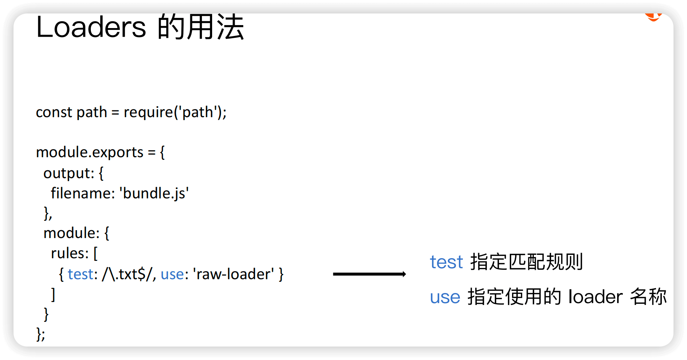

Q1 如何安装 本地webpack

A: <br/>

1. 安装 nvm + node + npm/yarn

2. 安装 webpack + webpack-cli

```bash
1. yarn init -y

2. yarn add webpack webpack-cli -D
```

-------------------------------------------------
Q2 webpack的 默认最简使用方法 是什么

A: <br/>

1. 最简单的情况下，webpack是 0配置，开箱即用的==> 执行 `npx webpack` 生成dist目录

2. 如果想修改 打包的相关设置，比如指定入口文件、输出文件的路径，就需要 自定义webpack的配置文件
  - 默认的配置文件名称: webpack.config.js

3. 自定义 webpack的配置文件的 文件名称的方法

3.1 方法1:自定义配置文件名称: 通过 `npx webpack --config [自定义的配置文件名称]` 指定配置文件名称

3.2 方法2: 通过 package.json 的 scripts字段 指定 webpack命令
  - 在 scripts 字段中添加 ` "build": "webpack --config [自定义的配置文件名称]" `
  - 这样就可以通过 `npm run build` 命令来 打包了
  - 这种方法的实现原理是: 模块局部安装 会在node_modules/.bin目录中 生成一个 webpack命令的软链接，指向 webpack-cli
  - 具体原理解释，可见 


-------------------------------------------------
Q3 webpack的 最简配置组成 是什么

A: <br/>

1. entry: 指定打包的入口文件

2. output: 指定打包的输出文件
  - path: 指定打包的 输出文件目录
  - filename: 指定打包的 输出文件名称， 可以通过 [name] 占位符支持 多入口打包输出

3. mode: 指定打包的模式：development/production

4. module: 指定文件的 处理规则
  - rules: 一般用于 配置Loader

5. plugins: 配置插件


-------------------------------------------------
Q4.1 webpack里 entry的作用

A: <br/>

1 entry: 用于 指定打包的入口文件

2 webpack 会从指定的entry文件开始，找到它所有依赖模块(即一棵依赖树)，进行打包

3 entry的值 可以是一个 字符串/对象
  - 字符串: 指定一个入口文件
  - 对象: 指定多个入口文件，并且可以指定不同的 打包规则

3.2 单入口(SPA) 和 多入口(MPA) 各自的适用场景
  - SPA: 更适用于 灵活变更/ 重交互/ 重视离线功能/ 整体性能
  - MPA: 更适用于 安全稳定/ 重内容/ 重视SEO/     首屏性能


------------------------------------------------------------------
Q4.2 webpack里 为什么要使用loader，它有哪些作用

A: <br/>

1. 文件 转换/代理 工具
  - 由于webpack 本身只能处理 JS 和 JSON 文件

  - 所以引入了【loader】来转换 其他类型的文件，从而支持如 图片、CSS等文件类型；
  - loader也可以 代理(预处理)文件内容，比如 通过babel-loader 把ES6+语法 转换为 ES5语法；
  - loader可以被 链式调用


2. 统一为 模块化封装
  - 被loader处理的文件，都会被转换为ES Module模块，所以每一个资源 都可以被当做模块来使用


3. 资源优化
  - 通过loader 可以优化 文件的加载性能：比如 通过 url-loader 将图片转换为 base64 格式，减少HTTP请求


一句话总结:

> loader可以被理解为 文件处理器 + 模块化封装器

loader的最简配置示例，见


------------------------------------------------------------------
Q4.3 webpack里 为什么要使用plugin，它有哪些作用

A: <br/>

1. 要回答这个问题，先得了解 webpack的核心工作流程

S1 初始化阶段: 
  - 读取和合并 配置选项
  - 创建必要的对象和上下文:  Compiler对象等
  - 初始化内置插件和注册用户配置的插件
  - 触发 `environment` 和 `afterEnvironment` 钩子

S2 入口处理阶段:
  - 调用Compiler.run方法 + 创建 Compilation对象
  - 读取入口配置==> 确定构建的起点
  - 触发 `entryOption` 钩子

S3 模块解析阶段:
  - 从入口文件开始，解析模块路径
  - 读取模块内容
  - 触发 `normalModuleFactory` 和 `contextModuleFactory` 钩子

S4 构建阶段: 
  - 调用loader 处理模块内容
  - 生成模块的 AST
  - 触发 `buildModule` 和 `normalModuleLoader` 钩子

S5 依赖图构建阶段:
  - 根据模块间的依赖关系，构建依赖图
  - 处理循环依赖

S6 优化阶段:
  - 执行各种优化操作，如 tree shaking、代码分割等
  - 触发 `optimize`、`optimizeModules`、`optimizeChunks` 等钩子

S7 代码生成阶段:
  - 根据优化后的依赖图，生成最终的代码
  - 创建 asset对象
  - 触发 `seal` 和 `afterCompile` 钩子

S8 输出阶段:
  - 将生成的文件写入输出目录
  - 触发 `emit` 钩子

S9 完成阶段
   - 清理工作 + 完成构建过程
   - 触发 `done` 钩子


2. plugin 和 loader 的区别/ 各自作用

S1 执行时机不同
  - loader: 主要在 模块解析和构建阶段 执行
  - plugin: 在 webpack运行的 不同生命周期阶段 执行

S2 功能范围不同
  - loader: 主要负责 文件的转换/ 预处理
  - plugin: 可以通过暴露的钩子函数，执行各种扩展任务

S3 扩展性质不同
  - loader: 扩展了 webpack 能够处理的文件类型
  - plugin: 扩展了 webpack 的核心功能和行为，如 打包优化、资源管理、环境变量注入、打包分析、跨loader/跨执行阶段的复杂任务

S4 抽象层次不同
  - loader: 在文件级别工作，处理单个资源文件
  - plugin: 在编译级别工作，影响整体构建流程


3. 选择用 loader 还是 plugin的 直观判断依据
  - 如果需要 转换/预处理 某种类型的文件，使用 loader
  - 如果需要 影响整个构建过程，使用 plugin

> 即 loader是 “文件级别的 转化器”，plugin是 “构建过程的 扩展器”

