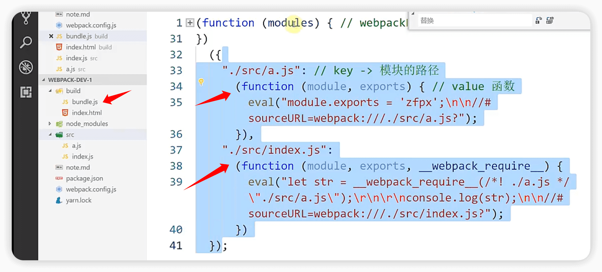

Q1 如何安装 本地webpack

A:  

1. yarn init -y

2. yarn add webpack webpack-cli -D

-------------------------------------------------
Q2 webpack 有什么作用，为什么要使用webpack

A:  

1. webpack 是前端【模块化打包工具】

2. 它会以入口JS文件为起点，找到它所有依赖的模块，进行打包，生成一个JS模块，记作bundle.js

3. 打包后的bundle.js文件，支持前端模块化规范，而且可以 直接在浏览器环境中运行

> 即 作用1: 支持模块化 + 打包所有 依赖模块

-------------------------------------------------
Q3 如何使用webpack进行 最基本的基础打包

A:  

1. 最简单的情况下，webpack是 0配置，开箱即用的==> 执行 `npx webpack` 生成dist目录

2. 如果想修改 打包的相关设置，比如指定入口文件、输出文件的路径，就需要 自定义webpack的配置文件
  - 默认的配置文件名称: webpack.config.js

-------------------------------------------------
Q4 webpack.config.js 配置文件中，有哪些常用的配置项

A:  

1. entry: 指定打包的入口文件

2. output: 指定打包的输出文件
  - path: 指定打包的 输出文件目录
  - filename: 指定打包的 输出文件名称

3. mode: 指定打包的模式：development/production

-------------------------------------------------
Q5 bundle.js文件 里的代码内容是什么

A:  

1. 整体结构是一个立即执行函数
  - 参数: 对象 {[入口模块A]: A模块内容函数, [A里的依赖B]: B模块内容函数 }

见图:

