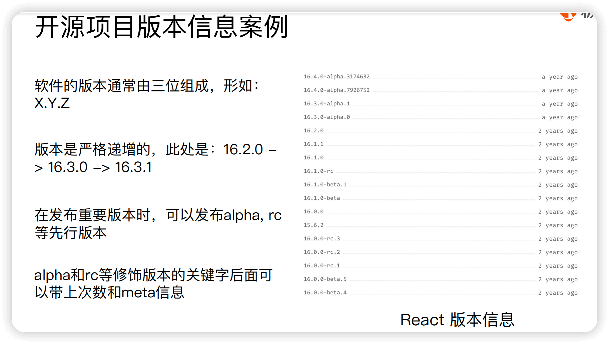
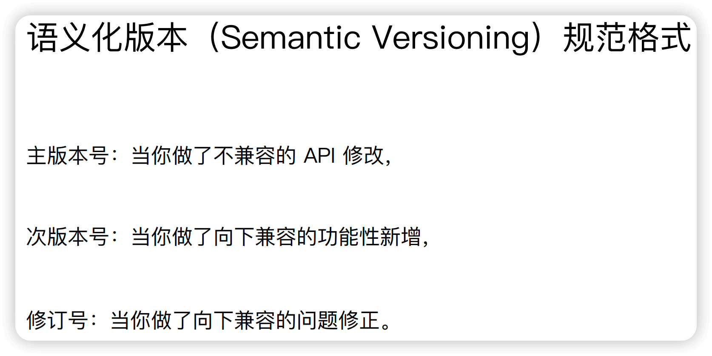
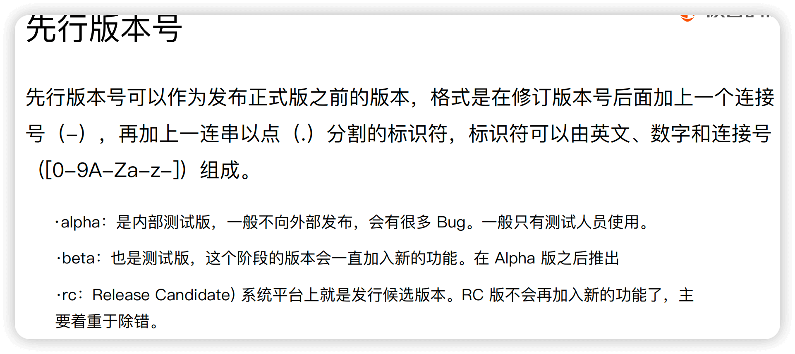
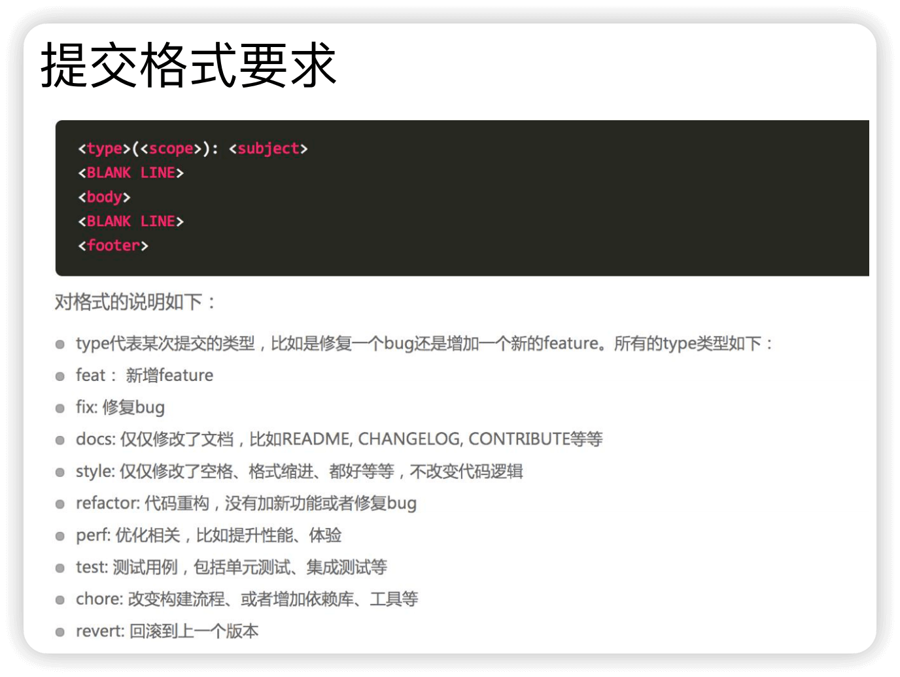

## 工程化部署

Q1.1 开源项目 版本号信息含义 + 语义化版本规范

A: <br/>

1 

2 

3 


---------------------------------------------------------------------
Q2.1 如何使用 Git规范 + 如何生成 Changelog 

A: <br/>

1.1 前端 Git规范一般遵循 angular.js的 日志规范，主要约束的是 git commit 内容
  - 提交类型被限制为 feat/ fix/ docs/ style/ refactor/ perf/ test/ chore/ revert 等
  - 提交信息分为2类: 标题 + 主题内容

1.2 良好的 Git commit 规范的 作用：
  - 后续维护者可以知道 Feature 被修改的原因
  - 根据 Git Commit 的元数据生成 Changelog
  - 加快 Code Review 的流程

1.3 Git规范 辅助工具
  - 提交类型 友好提示: commitize工具
  - 不符合规范时的 拒绝提交工具: validate-commit-msg工具 + gitlab server hook
  - 统一 changelog 文档信息生成: conventional-changelog- cli 工具


2.1 具体 提交规范格式说明，见下图




2.2 本地开发阶段增加 precommit 钩子 的步骤

S1 安装 husky + 通过 commitmsg 钩子校验信息

```js
npm install husky --save-dev
```

-p angular: 指定使用的预设配置（preset）为 angular 的提交规范

-s: 表示 "same file"（相同文件）。这个参数告诉工具直接将内容输出到输入文件中，而不是输出到控制台

-r 0: 表示 "release count"（发布计数）
  - 0 表示生成所有版本的变更记录
  - 如果是 1 则只生成最新版本的变更记录
  - 如果是 2 则生成最近两个版本的变更记

```json
"scripts": {
  "commitmsg": "validate-commit-msg",
  "changelog": "conventional-changelog -p angular -i CHANGELOG.md -s -r 0"
},

"devDependencies": {
  "husky": "^0.13.1"
  "validate-commit-msg": "^2.11.1",
  "conventional-changelog-cli": "^1.2.0",
}
```

2.3 具体 changelog示例图，见下图


## 参考文档

[01-极客时间-git规范+changelog 部分](/)
